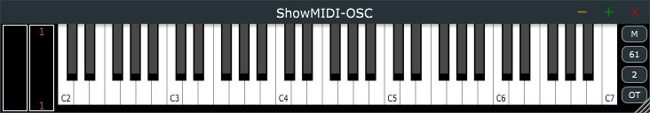

# ShowMIDI-OSC

This is a version of [ShowMIDI](https://github.com/getdunne/ShowMIDI) for use with DAWs that don't support MIDI-insert plug-ins. It runs as a stand-alone application on Windows or Mac, and works with the free [TouchOSC Bridge by Hexler](https://hexler.net/products/touchosc).

See http://getdunne.net/download/showmidi-osc for usage details, and links to download pre-built versions (with PlugInGuru branding).

I developed this for [John Lehmkuhl](https://www.pluginguru.com/) to use in his [YouTube videos](https://www.youtube.com/channel/UCuKxBfrjXMDZZfuP_bfSHFA), where it's useful to be able to see the actual keyboard input (often quite simple) that results in a particular sound (often complex due to intricate programming).

Requires [JUCE 5.x](https://shop.juce.com/get-juce), hence subject to the GNU GPL v3 license. Use the *Projucer* to generate the necessary projects, e.g. VST2 for Windows, Audio Unit for Mac.
